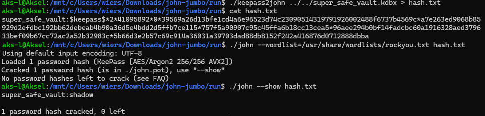
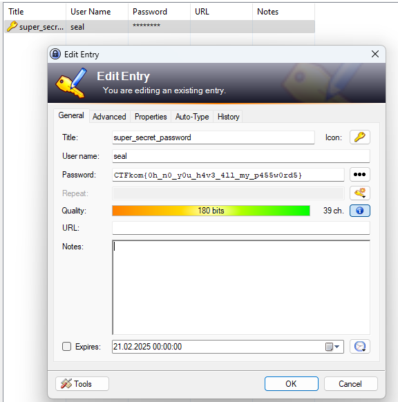

# Password Cracker

This challenge provides the file `super_safe_vault.kdbx` which is a password-protected "vault".
The challenge description heavily hints towards the password being included in `rockyou.txt`. Because of that, it should be brute forceable.
I'll use [john](https://github.com/openwall/john) to crack it. 

First get the john-hash of the kdbx file, use john on it using rockyou, and then wait for a successful crack:

The password is `shadow`

After logging in with the correct password, i can look at the one entry in there, which has the flag.

Flag: `CTFkom{0h_n0_y0u_h4v3_4ll_my_p455w0rd5}`
