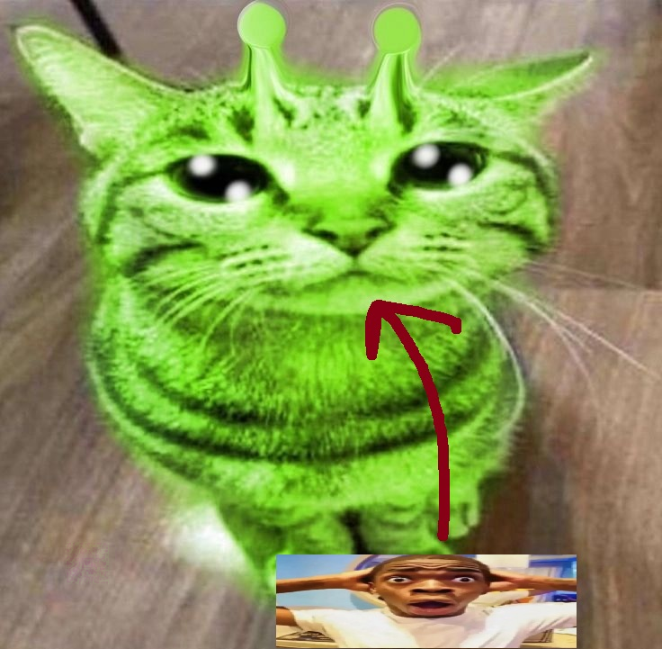
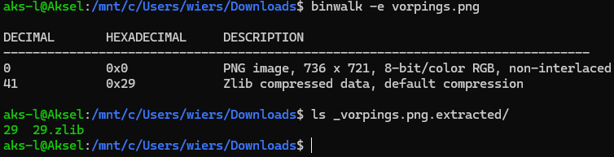
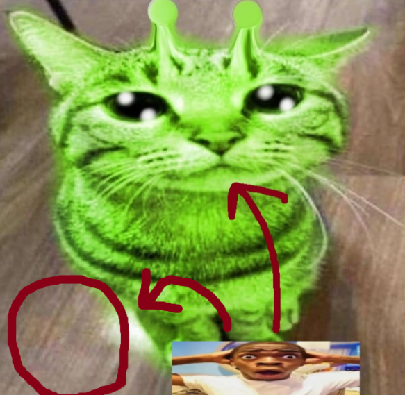
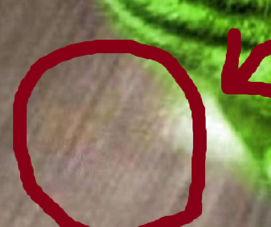
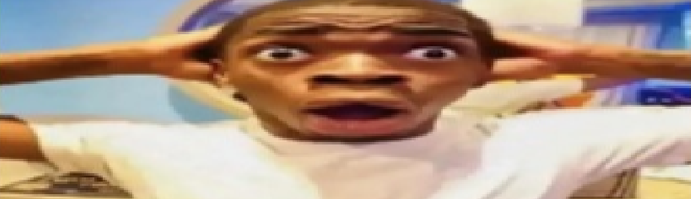
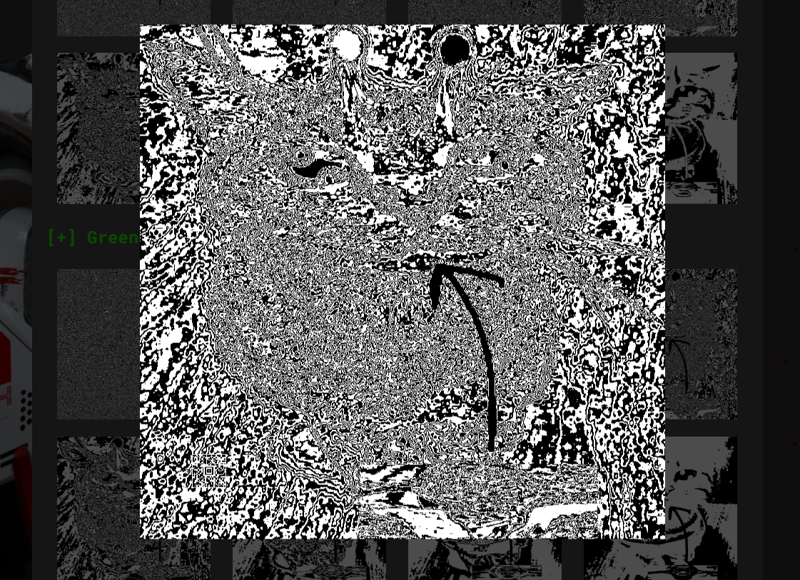
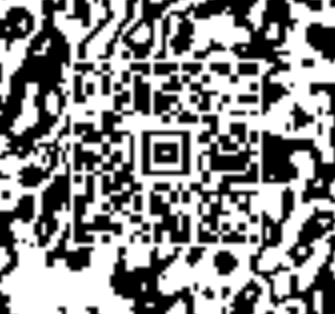
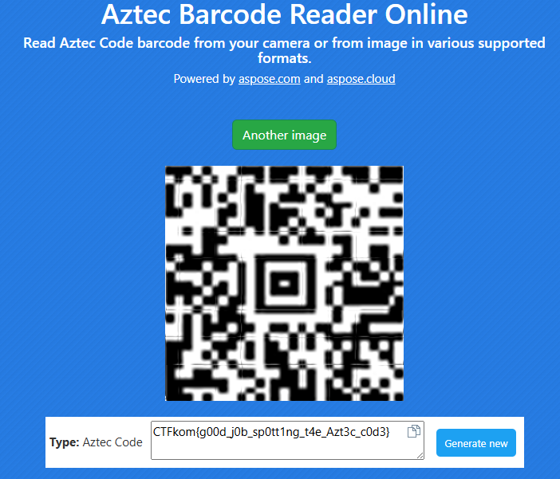

# Who gleeped my glorps?
### Steganography
```
Zinky zoogle, zeekyboble beeble meep forp meeeoww Bogos Binted? zim zim haha 👽👽👽! zhoomans zee like: "Why is this cat geen?" zhazhazhazha! zogorob bleeepeepes "Yo mama green!" zha zha zhaaaaa!
```

This challenge has only a single photo as a handout:



Since it is a stego-challenge let's start with the basics; Plug it into [aperisolve](https://www.aperisolve.com/).

Instantly, there is nothing obvious in the superimposed images, and no obvious strings or anything of interest in the image data seen through exiftool.

There is something seen with binwalk, lets extract it with `binwalk -e vorpings.png`.



Nothing of interest, just some useless zlib data.

Let's take a closer look at the image. See that?






There is obviously something there, but the colors are to blurred to see it clearly. Since we know there is something there now, let's take another look at the aperisolve photos. There is a slight hint in the challenge description here `Why is this cat green?`, so let's focus on the green values of the image.



When zooming into the area of *something*, we see a much clearer code.



This is an Aztec code, which looks like a QR code, and works somewhat the same. It is quite low resolution, and the rows and columns are uneven, but after adjusting the photo with the wonderful MS Paint, it looks better. Now it should be possible to decrypt it with a standard online decrypter

https://products.aspose.app/barcode/recognize/aztec might suffice.

Initially, it fails, and yields `No barcodes fo.und.`, but with the handy `Try better recognition quality`-button in exxelent-mode, it succeeds.



Flag: `CTFkom{g00d_j0b_sp0tt1ng_t4e_Azt3c_c0d3}`