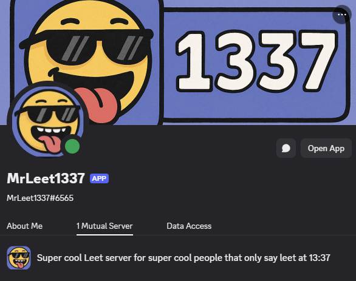
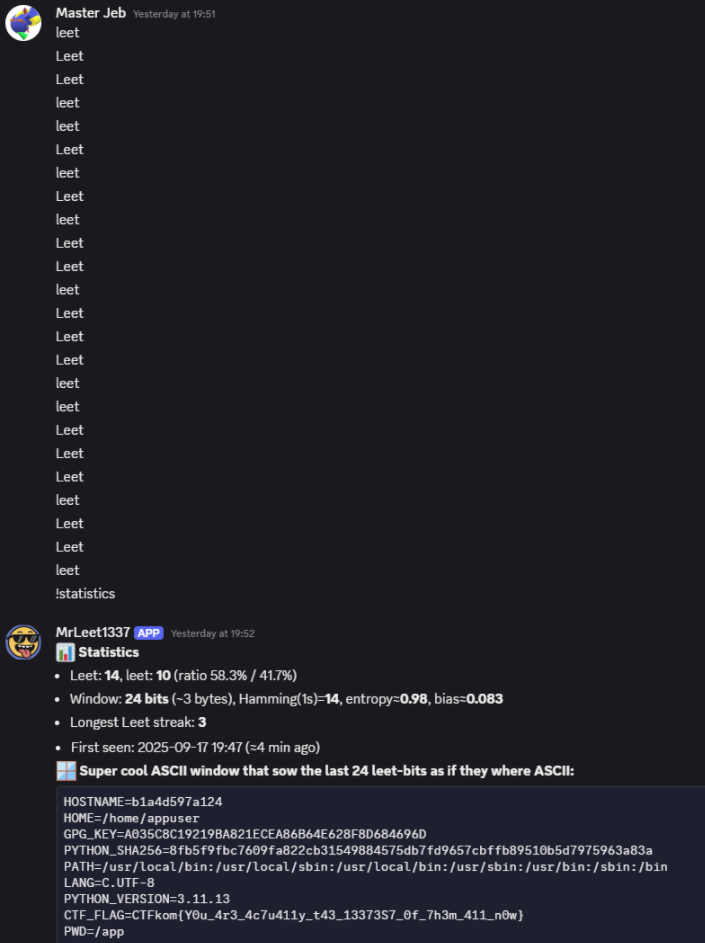

# MrLeetBot's Revenge
### Misc
```
So we fixed the time bug from last time. We also got some complaints that you could only write "leet" and not "Leet". So we got our intern to fix this
the board and added a bunch of ther unnecessary features, and he just force pushed them to main! Well i don't have time to fix it now so i just hope it works file.
```

This challenge supplies us with the source code of the bot `bot.py` and a Discord server where the bot is hanging out.



To get the flag, simply send `leet` to the bot at exactly 13:37. There is only one problem; the CTF runs from 18:00 to 21:00.
Luckily, there is a huge flaw in the bot's code.

The function `!statistics` shows a nice display of your `leet:Leet` ratio, your streak, some other info, and the most interesting: the `🪟 Super cool ASCII window that sow the last 24 leet-bits as if they where ASCII:`

The intended purpose of this seems to assign each `leet` (lowercase) to the value 0, and `Leet` (uppercase) to 1. Then the previous 24 leets will create a binary pattern, and will be shown in ascii.

However, for some reason, before the output can be printed,
```python
# You gotta chech that the system can handle it first
os.system(f"{cool_ascii_word} > {tf} 2>&1")
```
what??

This causes the ascii string to be executed as a command directly in the shell of the bot. Since we only have 24 bits or 3 bytes, we are very limited as to what can be executed, but we still have enough.

A subtle hint in the source code is how the bot token had to be added in a way only mentioned through a comment.
```python
    """
    Load the bot token without exposing it in the environment.
    Priority:
      1) DISCORD_TOKEN env (if present)
      2) local secret files (Docker secret, dotfile, or txt)
    """
```
Why would it matter that the token was in the environment? That is usually safe. Of course, because we have to leak the environment variables to get the flag, which is stored as `CTF_FLAG`:
 ```python
CTF_FLAG = os.environ.get("CTF_FLAG", "flag{demo}").strip()
```
*If the bot token was also in here, because of the vulnerability, anyone could see it, and control the bot or ruin the challenge in any way they want.*

To see all set environment variables, we simply have to write `env` to the shell. How do we do this through the bot? Well, we take advantage of the vulnerability, and forge the string "env" by writing the correct sequence of leets and Leets, which get translated to 0s and 1s, to write the binary form of the ascii values of each letter.

e -> 01100101
n -> 01101110
v -> 01110110

Now after 24 [Ll]eets, we will have entered "011001010110111001110110" into the buffer, which will execute the command env. 

Now the expected output of the Super cool ascii art field should be all environmental variables, let's try:



We see `CTF_FLAG=CTFkom{Y0u_4r3_4c7u411y_t43_13373S7_0f_7h3m_411_n0w}`, and the challenge is completed.

Flag: `CTFkom{Y0u_4r3_4c7u411y_t43_13373S7_0f_7h3m_411_n0w}`